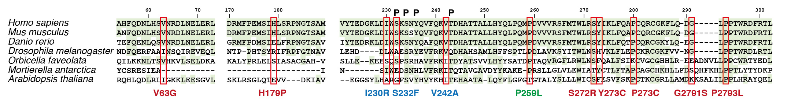

## MSA

Several Blast searches were done using human MED27 protein (`MED27_HUMAN`) against several taxa.

The protein is highly conserved in certain taxa, but the selective pressure on the gene is highly variable, 
while for deuterostomes it is ultra-conserved, for other animals it is all over the place.
Namely, MED27s in arthopods and mollusks are on the 38+% percent identity mark and in sponges and cnidarians are at ~32%.
However, for other protostomes its lower: _C. elegans_ does not have a copy —but other nematodes do at a 25-28% mark.
Nematodes are a sister clade to arthopods, while mollusks are a sister clade annelids
with first flatworms and then rotifers as basal clades. Rotifers and flatworms lack MED27.

This means that gene must have had strong selective pressure in the urbilateran,
but in multiple invertebrate clades the pressure was lost.

This raises the question for another time: why is MED27 essential in corals, vertebrates, arthropods and mollusks, 
but not in some invertebrates. The pathology in humans is neuronal, but nematodes have nerves, while corals do not.

Similarly, whereas yeasts lack MED27, basal fungi appear to possess it. Further afield plants also possess MED27.
In these however, the N-terminal helical bundles are not at all conserved.

In the final figure human, mouse (because the model is mouse), zebrafish, fruit fly, stony coral, a basal fungus and thale cress were used.

The stony coral was chosen because it was highest hit.

The basal fungus, `Mortierella`, was chosen as it's the type genus of an order (`Mortierellales`).
Its phylum, `Mucoromycota`, is basal to the others, so the gene loss event happened in the crown group.

## Methods

Blast searches were done to get the IDs of proteins of interest. These were aligned with the [EMBL Muscle server](https://www.ebi.ac.uk/Tools/msa/muscle/).

    >Homo sapiens
    -----------------------MADVINVSVNLEAFSQAISAIQALRSSVSRVFDCLK-
    ----DGMRNKETLEGREKAFIAHFQDNLHSVNRDLNELERLSNLVGKPSENHP-LH----
    -----------------NSGLLSLDPVQ--------DKTPLYSQLLQAYKWSNKLQYHAG
    LASGLLN--------------QQSLKRSANQMGVSA-------KRRPKAQPTTLVLPPQY
    VDDVISRIDRMFPEMSIHLSRPNGTSAMLLVTLGKVLKVIVVM------RSLFIDRTIVK
    GYNENVYTEDGKLDIWSKSNYQVFQKVTDHATTALLHYQLPQMPDVVVRSFMTWLRSYIK
    LFQAPCQRCGKFLQ-DG-----LPPTWRDFRTL---------E--AFHDTCRQ---
    >Mus musculus
    ------------------------------------------------------------
    ------MRNKETLEGREKAFIANFQDNLHSVNRDLNELERLSNLVGKPSENHP-LH----
    -----------------NSGLLSLDPVQ--------DKTPLYSQLLQAYKWSNKLQYHAG
    LASGLLN--------------QQSLKRSANQMGVSA-------KRRPKAQPTTLVLPPQY
    VDDVISRIDRMFPEMSIHLSRPNGTSAMLLVTLGKVLKVIVVM------RSLFIDRTIVK
    GYNESVYTEDGKLDIWSKSSYQVFQKVTDHATTALLHYQLPQMPDVVVRSFMTWLRSYIK
    LFQAPCQRCGKFLQ-DG-----LPPTWRDFRTL---------E--AFHDTCRQ---
    >Danio rerio
    -----------------------MADVMNVGVNLEAFSQAINAIQALRSSVTRVFDFLK-
    ----DGMKNKETLESREKVFITEFQENLQSVNRDLNELERLSTLVGRPSESHP-LH----
    -----------------NSGLLSLDPVQ--------DKTPLYSQLLQAYKWSNKLQYHAG
    LASSLLN--------------QQSLKRSANQMGTSA-------KRRPKVQPSTLALPTQY
    VDDVISRIGRMFPDMSIELFRPNGTSAVLLVTLGKVLKAIVVM------RSLFIDRTIVR
    GFHENIYTEDRKLDIWSKSNYQAFQKVTDHATTALLHYQLPQMPDVVVRSFMTWLRSYIK
    LFQTPCQRCGKYLQ-EG-----LPPTWRDFRTL---------E--AFHDTCRQ---
    >Drosophila melanogaster
    ---------------------------------MDKLNSTLTAVKNLRSNVRLCFEHLA-
    ----DGTDGESGEESRNK-FVNDFQERFAAINSQIREVEQLINGLPVPPTPYS-LG----
    -----------------NTAYLAQETSQ--------DRQALYPQLVNSYKWMDKVHDHSF
    LAFNNLN--------------QNTLRRSYN---YCS-------QKRQRLPFSSFNNDPDH
    IDKLLSEINTP-PHTSYRIFRPFGTNAVTIVTISNVMKAAIVF------KGVLIEWVTVK
    GFDEPLEHD----DLWAESRYEVFRKVQDHAHSAMLHFFSPTLPDLAVKSYITWLNSHVK
    LFLEPCKRCGKFVV-NG-----LPPTWRDLRTL---------E--PFHEDCRNC--
    >Orbicella faveolata
    --------MLGTGTGQYPAQSLSGCALGIMADKVKSIDEVVSTANSLRATVSKVFQDLAT
    NPSVNKETGDSSETSKGGNITQILKKNLTSVHKVLSELDKANEGLSSLDGRSPSLG----
    -----------------NTGLLSLDPVE--------DKTPLYDKLLETYDWHEKLTSEAQ
    HALS-------------------CLKRHHPPAAQSL-------DRSPSSAKRAKTNLKGE
    IQKALQDCKALYPRLELSIASACGAH-VLKVLVPKTLKATIVL------RMTEIDQVIIR
    GIQESSLLE--KEESQSPSRHAVFRKITDYATSVVLHYYSATDPTAQVRGFLRWLNSFQA
    LFSIKCVGCGHHLR-EEADNVLLPPCWRTYEDL---------S--PYHYQCRP---
    >Mortierella antarctica
    ------------------------------MTATEEIHAAIEKNKSSLQDIELMINSV--
    -----GSCPRGSVPGTRKVYIYCSRESIEA---------------GYQFGRNPQSS----
    -----------------VGAESTLESTK--------RREYLNLSVDDTLRWFKRSARQSG
    LRV----------------------------FAVRL-------GDQPSLPFS--------
    ---------------------------IVKVCIAGVLNAFIVMETSKKGRCLAISRLVVF
    GAGEEN-------SIWEDSNHLVFRKITQTAVGAVDYYKAKE-PRSLLGLVLEWIATYCT
    LFTAPCAGCHKHLLFDSQHFKHLPPTLYTYDKP---------KPAPFHPQCLA---
    >Arabidopsis thaliana
    MQTLHQSQLLQNPAEAANNQSESDAPPKQVAQAMERLNQAARVIADIRLGADRILEAMFV
    ASQPRHTDMPLQLFLREDASMRQHLQDLRLIGKKLEESGVLTESLRSRSNSWG-LHMPLV
    CPDGAVVAYAWKRQLAGQAGASAVDRTRLALKAFTDQKRRFFPHIDDGLKMEPSSKKHRA
    SHLLLENGREEPVDYKTLPDIQSRLEKLVPSVKVSTYGRLNWLKRANSLPGSGSDDPTEA
    SKPIFQSSSKLRSGLQTEVV---DKIAVIELSFPSLFRAIVSL-----SPAGSVDPDAVA
    FFSPD--EGGSYLHARGFSVYHVYKHITEHAATA-LQYFLGFGTGTALYSLLLWICSFES
    VFSKPCTKCGRLLAMDKKSALILPPLHRAYQELPLALNLDVCE--AYHSSCSQDDT

Then the [EMBL MView server](https://www.ebi.ac.uk/Tools/msa/mview/) was used with CONCOLORMAP set to red.
In order to get focused spans the following was done first:

    from Bio import AlignIO
    
    alignment = AlignIO.read(open("small.al.fa"), "fasta")
    print("Alignment length %i" % alignment.get_alignment_length())
    
    for record in alignment:
        if record.id == 'Homo':
            human = record
            break
    alen = alignment.get_alignment_length()
    human_map = [i - human.seq[:i].count('-') for i in range(alen)]
    #list(zip(human.seq, human_map)) # ('M', 0),
    
For each region of interest:

    resi = 63 #179 #
    interested = slice(human_map.index(resi)-10, human_map.index(resi)+10)
    for record in alignment:
        print(f'>{record.description.replace(" ","_")}')
        print(record.seq[interested])

The output was printed to PDF and opened in Illustrator.