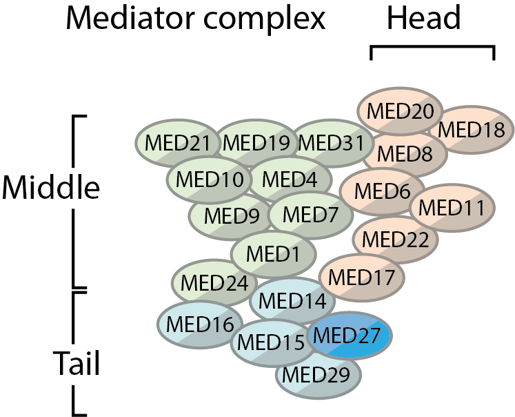
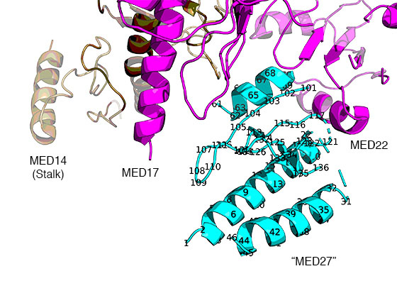

# MED27_analysis
Analysis of variants of MED27 (no mutant data is stored here)

## State of the art

MED27 is part of the mediator complex. This is a huge complex.

A lot of research has gone into this, as [summarised in a recent review](https://www.ncbi.nlm.nih.gov/pmc/articles/PMC6393861/).

Most structures are from either brewer's year or fission yeast, none from humans.

* There are several parts ('modules'), the head, the middle and the tail, the stalk (MED14) and the CDK8 module.
* The stalk connects the head, middle and tail.
* The head is connected to the top of the middle so actually is on the side.
* The head may or may not join to the tail (MED17 and MED27)
* The tail is composed in brewer's yeast by MED2, MED3, MED5, MED15 and MED16.
* The [potential homologues](https://academic.oup.com/nar/article/36/12/3993/1135622) MED29, MED27 and MED24 take the role of MED2, MED3 and MED5 in metazoa
* Humans also have additionally MED25 in the tail
* Humans also have additionally MED26 in the middle
* Humans also have additionally MED27, MED28, MED29 and MED30 in the head
* Humans also have two copies of MED12 (MED12/MED12L) and MED13 (MED13/MED13L), which are specific for CDK8/19
* MED2, MED3 and MED15 form a subgroup as seen [XL-MS](https://www.cell.com/cell/fulltext/S0092-8674(16)31147-3) and [cyroEM](https://www.cell.com/cell/fulltext/S0092-8674(14)00609-6).
* In the [cyroEM](https://www.cell.com/cell/fulltext/S0092-8674(14)00609-6) MED3/MED27+MED2/29+MED15 form an L shape that binds to MED16 and MED14.
* There is a [4.4 Å cryoEM model](https://www.nature.com/articles/nature21393) (PDB:5U0P) with three short chains of MED3, but MED2 and MED15 aren't resolved as aren't other members of the tail.
* There are no available human nuclear cross-linking mass spec studies with a resolution sufficient to find contacts between MED29, MED27 and MED15.
* As human MED29 is much smaller than yeast MED2 and human MED27 larger than yeast MED3, it cannot be said whether MED29, MED27 and MED15 from an L shape
* the MED29, MED27 and MED15 subcomplex may have one lone helix forming a bundle with a helix from another, therefore any theoretical model may be biased.
* the XL-MS interaction in MED3 may, or may not be accurate for MED27.

## Models

Phyre2 and ITasser models were made and energy minimised with Pyrosetta (1 cycle with `ref2015_cart` and 15 with `ref2015`).

| model           |   total_score |   fa_atr |   fa_rep |   fa_sol |   fa_intra_rep |   fa_elec |   fa_dun |   rama_prepro |   omega |
|----------------:|--------------:|---------:|---------:|---------:|---------------:|----------:|---------:|--------------:|--------:|
| weights (ref2015)         |              |     1.0  |  0.55  |  1.0  |  0.005  |  1.0  |  0.7  |  0.45  |  0.4   |
|  MED27_ITasser_4 |        -666.9 |  -1826.4 |    427.8 |   1208.5 |          738.7 |    -581.2 |    528.1 |         240.6 |    88.1 |
|  MED27_ITasser_1 |        -614.5 |  -1942.7 |    481.9 |   1303.5 |          700.6 |    -604.1 |    545.2 |         402   |   102.6 |
|  MED27_ITasser_2 |        -585   |  -1883.9 |    438.7 |   1278.2 |          725.9 |    -593.4 |    545.7 |         404.3 |   122.9 |
|  MED27_ITasser_3 |        -546   |  -1825.9 |    439.5 |   1193.2 |          758.9 |    -534.2 |    515.9 |         380.2 |   136.7 |
|  MED27_ITasser_5 |        -537.9 |  -1741.2 |    412.3 |   1125.7 |          846.3 |    -503.7 |    526.1 |         289   |   107.7 |
|  MED27_phyre     |        -318.6 |  -1626.9 |    415.6 |   1040.2 |         1187.1 |    -451.6 |    525.9 |         562.1 |    56.7 |

The top ITasser model has a projected RSMD from a hypothetical solution of 15 Å (bad).
It has a slightly higher ∆G than ITasser model 4, 
but the attractive term of the Lennard-Jones equation and the electrostatic term are better.

### CryoEM
The only structure available is the low resolution _S. pombe_ highly disordered fragment, which is binding to MED17 and MED22 (head)
and not MED14, the stalk.

The homology to 5U0P_2 was so low it wasn't a big player in the models. None of the models resolved remotely similarly to it.
So this is best ignored.

### XL-MS
Aligning `MED3_YEAST` and `MED27_HUMAN` with Muscle gives the following:

    MED3  MDSIIPAGVKLDDLQVILAKNENETRDKVCKQINEARDEILPLRLQFNEFIQIMANIDQEGSKQADRMAKYLHIRDK--ILQLNDRFQTLSSHLEALQPLFSTVPEYLKTADNRDRSFQLLEPLSTYNKNGNAVCSTATVVSTNHSAAASTPTTTATPHANPITHAHSLSNPNSTATMQHNPLAGKRGPKSGSTMGTPTVHNSTAAAPIAAPKKPRKPRQTKKAKAQAQAQAQAQAQVYAQQSTVQTPITASMAAALPNPTPSMINSVSPTNVMGTPLTNMMSPMGNAYSMGAQNQGGQVSMSQFNGSGNGSNPNTNTNSNNTPLQSQL-NLNNLTPANILN--MSMNNDFQQQQQQQQQ--QQQPQPQYNMNMGMNNMNNGGKELDSLDLNNLELGGLNMDFL
    MED27 MADVINVSVNLEAF-------------------SQAISAIQALRSSVSRVFDCL----KDGMRNKETLEG----REKAFIAHFQDNLHSVNRDLNELERLSNLVG---KPSENH--------PLH------------------NSGLLSLDPVQDKTPLYSQLLQAYKWSN-----KLQYHA-----GLASG-LLNQQSLKRSANQMGVSAKRRPKAQPTTLVLPPQYVDDVISRIDRMFPEMSIHLSRPNGTSAMLLVTLGKVLKVIV---VMRSLFIDRTIVKG--YNENVYTEDGKLDI--WSKSNYQVFQKVTDHATTALLHYQLPQMPDVVVRSFMTWLRSYIKLFQAPCQRCGKFLQDGLPPTWRDFRTLEAFHDTCRQ-------------------

Using this and the data from [the yeast XL-MS dataset](https://www.cell.com/cell/fulltext/S0092-8674(16)31147-3),
allows some tentative tests. This assumes that the sections are structurally conserved and the pairwise alignment is correct
—which it does not.

Of note is that the MED3 residue 20–27 interaction had to be removed as as these flank a gap (both correspond to residue 14)
None of the models have a loop at residue 14. Whereas the residue 14 on a loop link is consistent with 5U0P_2 two short helices.
They all have a straight helix in the models.
Here are the distances of the CA atoms in Å.

| name                        |   10-79 |   40-50 |   40-47 |   50-47 |   50-124 |
|-----------------------------:|--------:|--------:|--------:|--------:|---------:|
|  MED27_ITasser_4 |    12   |     8.8 |    11.1 |     4.9 |     30.3 |
|  MED27_ITasser_1 |    17.8 |    17.4 |    15.5 |     8.2 |     30.2 |
|  MED27_ITasser_2 |    10.4 |    13.4 |    14.6 |     5.3 |     12.9 |
|  MED27_ITasser_3 |    14.3 |     8.5 |     9.4 |     5.6 |     10.3 |
|  MED27_ITasser_5 |    35.9 |    17.4 |    16.4 |     5.1 |     45.4 |
|  MED27_phyre    |    13.2 |    16.3 |    13.5 |     7   |     56.5 |

In terms of distances, the residue pairs 10–79 and 50–124 are distant.
The former pair, although closer in ITasser4, is problematic in both ITasser 4 and ITasser 1 (core residue pointing away).
Same for the latter.

Therefore, this dataset is not helpful. Consequently going with ITasser's top ranked pose is the best option.

