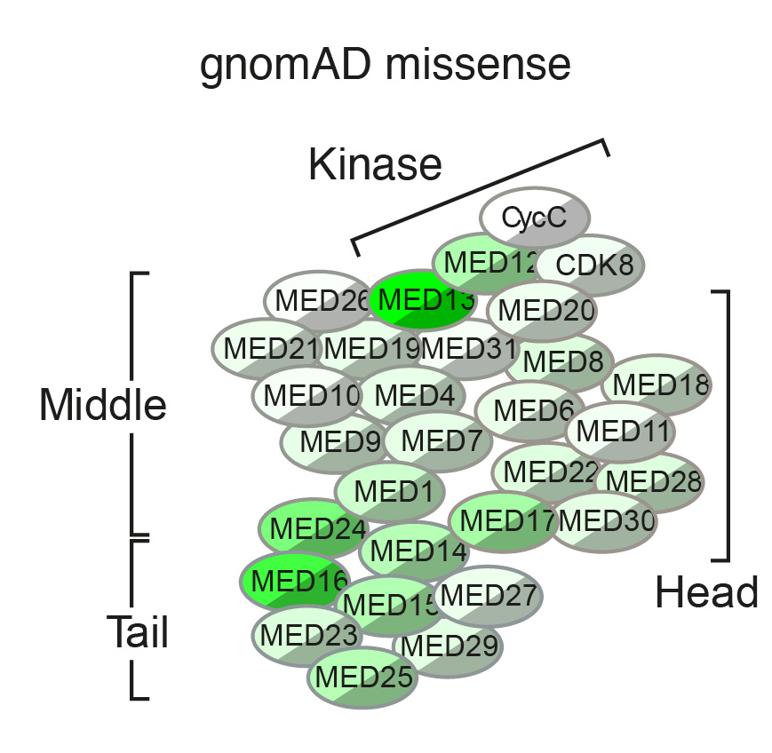
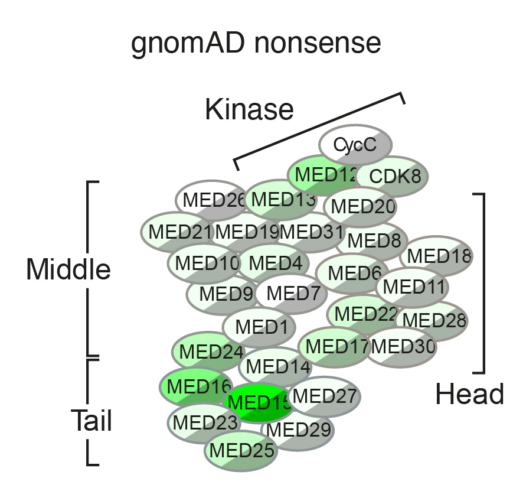
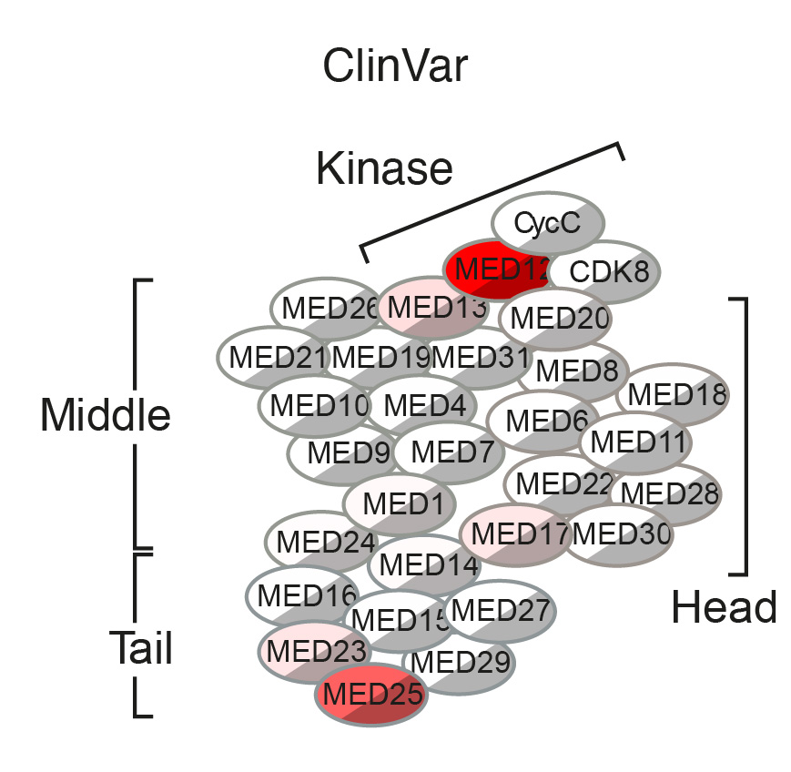
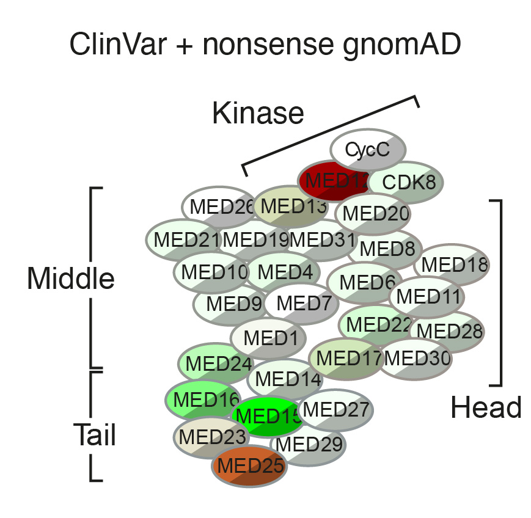

# Get data for all MED proteins

> This extends the discussion in [metadata assembly](scripts/metadata_assembly.md).

## Get base data

Like for metadata assembly, using michelanglo data to start with

    from michelanglo_protein import ProteinCore
    
    ProteinCore.settings.verbose = True #False
    ProteinCore.settings.startup(data_folder='/Users/matteo/Coding/michelanglo/protein-data')
    
    # as seen in michelanglo_app/views/uniprot_data.py
    import json, os
    human = json.load(open(os.path.join(ProteinCore.settings.dictionary_folder, 'taxid9606-names2uniprot.json')))
    
Make table
    
    from collections import Counter

    seen = ['Q9UQD0', 'P0DP75', 'Q8WU39', 'Q5VYS4']
    data = []
    for gene_name in human:
        if ('MED' in gene_name or gene_name in ('CCNC', 'CDK8', 'CDK19')) and\
            'TMED' not in gene_name and\
            human[gene_name] not in seen:
            p = ProteinCore(uniprot=human[gene_name], taxid=9606).load()
            seen.append(human[gene_name])
            gnomAD_type = Counter([v.type for v in p.gnomAD])
            gnomAD_homo = ','.join([v.description.split(' ')[0] for v in p.gnomAD if v.homozygous])
            gnomAD_het = ','.join([v.description.split(' ')[0] for v in p.gnomAD if not v.homozygous])
            print(gnomAD_type)
            data.append({'gene_name': p.gene_name,
                         'recommended_name': p.recommended_name,
                         'uniprot': p.uniprot,
                         'uniprot_name': p.uniprot_name,
                         'ENSG': p.ENSG,
                         'ENSP': p.ENSP,
                         'ENST': p.ENST,
                         'length': len(p),
                         'gnomAD_missense': gnomAD_type['missense'],
                         'gnomAD_other': gnomAD_type['other'],
                         'gnomAD_nonsense': gnomAD_type['nonsense'],
                         'gnomAD_homos': gnomAD_homo,
                         'gnomAD_hets': gnomAD_het,
                         #'ExAC_type': p.ExAC_type,
                         #'pLI': p.pLI,
                         #'pRec': p.pRec,
                         #'pNull': p.pNull
                        })
       
Pandas time
    
    import pandas as pd
    genes = pd.DataFrame(data).sort_values('gene_name')
    genes.to_csv('MED_genes_v1.csv')
       
## semi-manual data for gnomAD                 
It is clear that there is a lot of non-canonical transcript issues in this data along with that it does not use gnomAD3.
Therefore a semi-manual data retrieval was done:

    from IPython.display import display, HTML
    
    link_template = '<a target="_blank" href="https://gnomad.broadinstitute.org/transcript/{row.ENST}?dataset=gnomad_r3_controls_and_biobanks">{row.gene_name}</a>'
    links = [link_template.format(row=row) for i, row in genes.iterrows()]
    display(HTML(' '.join(links)))
    
Giving: <a target="_blank" href="https://gnomad.broadinstitute.org/transcript/ENST00000523985?dataset=gnomad_r3_controls_and_biobanks">CCNC</a> <a target="_blank" href="https://gnomad.broadinstitute.org/transcript/ENST00000368911?dataset=gnomad_r3_controls_and_biobanks">CDK19</a> <a target="_blank" href="https://gnomad.broadinstitute.org/transcript/ENST00000381527?dataset=gnomad_r3_controls_and_biobanks">CDK8</a> <a target="_blank" href="https://gnomad.broadinstitute.org/transcript/ENST00000394287?dataset=gnomad_r3_controls_and_biobanks">MED1</a> <a target="_blank" href="https://gnomad.broadinstitute.org/transcript/ENST00000255764?dataset=gnomad_r3_controls_and_biobanks">MED10</a> <a target="_blank" href="https://gnomad.broadinstitute.org/transcript/ENST00000293777?dataset=gnomad_r3_controls_and_biobanks">MED11</a> <a target="_blank" href="https://gnomad.broadinstitute.org/transcript/ENST00000374102?dataset=gnomad_r3_controls_and_biobanks">MED12</a> <a target="_blank" href="https://gnomad.broadinstitute.org/transcript/ENST00000474524?dataset=gnomad_r3_controls_and_biobanks">MED12L</a> <a target="_blank" href="https://gnomad.broadinstitute.org/transcript/ENST00000397786?dataset=gnomad_r3_controls_and_biobanks">MED13</a> <a target="_blank" href="https://gnomad.broadinstitute.org/transcript/ENST00000281928?dataset=gnomad_r3_controls_and_biobanks">MED13L</a> <a target="_blank" href="https://gnomad.broadinstitute.org/transcript/ENST00000324817?dataset=gnomad_r3_controls_and_biobanks">MED14</a> <a target="_blank" href="https://gnomad.broadinstitute.org/transcript/ENST00000382974?dataset=gnomad_r3_controls_and_biobanks">MED15</a> <a target="_blank" href="https://gnomad.broadinstitute.org/transcript/ENST00000395808?dataset=gnomad_r3_controls_and_biobanks">MED16</a> <a target="_blank" href="https://gnomad.broadinstitute.org/transcript/ENST00000251871?dataset=gnomad_r3_controls_and_biobanks">MED17</a> <a target="_blank" href="https://gnomad.broadinstitute.org/transcript/ENST00000647352?dataset=gnomad_r3_controls_and_biobanks">MED18</a> <a target="_blank" href="https://gnomad.broadinstitute.org/transcript/ENST00000645681?dataset=gnomad_r3_controls_and_biobanks">MED19</a> <a target="_blank" href="https://gnomad.broadinstitute.org/transcript/ENST00000409312?dataset=gnomad_r3_controls_and_biobanks">MED20</a> <a target="_blank" href="https://gnomad.broadinstitute.org/transcript/ENST00000282892?dataset=gnomad_r3_controls_and_biobanks">MED21</a> <a target="_blank" href="https://gnomad.broadinstitute.org/transcript/ENST00000631196?dataset=gnomad_r3_controls_and_biobanks">MED22</a> <a target="_blank" href="https://gnomad.broadinstitute.org/transcript/ENST00000539158?dataset=gnomad_r3_controls_and_biobanks">MED23</a> <a target="_blank" href="https://gnomad.broadinstitute.org/transcript/ENST00000394128?dataset=gnomad_r3_controls_and_biobanks">MED24</a> <a target="_blank" href="https://gnomad.broadinstitute.org/transcript/ENST00000538643?dataset=gnomad_r3_controls_and_biobanks">MED25</a> <a target="_blank" href="https://gnomad.broadinstitute.org/transcript/ENST00000611692?dataset=gnomad_r3_controls_and_biobanks">MED26</a> <a target="_blank" href="https://gnomad.broadinstitute.org/transcript/ENST00000474263?dataset=gnomad_r3_controls_and_biobanks">MED27</a> <a target="_blank" href="https://gnomad.broadinstitute.org/transcript/ENST00000237380?dataset=gnomad_r3_controls_and_biobanks">MED28</a> <a target="_blank" href="https://gnomad.broadinstitute.org/transcript/ENST00000594368?dataset=gnomad_r3_controls_and_biobanks">MED29</a> <a target="_blank" href="https://gnomad.broadinstitute.org/transcript/ENST00000522839?dataset=gnomad_r3_controls_and_biobanks">MED30</a> <a target="_blank" href="https://gnomad.broadinstitute.org/transcript/ENST00000225728?dataset=gnomad_r3_controls_and_biobanks">MED31</a> <a target="_blank" href="https://gnomad.broadinstitute.org/transcript/ENST00000378586?dataset=gnomad_r3_controls_and_biobanks">MED4</a> <a target="_blank" href="https://gnomad.broadinstitute.org/transcript/ENST00000440435?dataset=gnomad_r3_controls_and_biobanks">MED6</a> <a target="_blank" href="https://gnomad.broadinstitute.org/transcript/ENST00000420343?dataset=gnomad_r3_controls_and_biobanks">MED7</a> <a target="_blank" href="https://gnomad.broadinstitute.org/transcript/ENST00000372457?dataset=gnomad_r3_controls_and_biobanks">MED8</a> <a target="_blank" href="https://gnomad.broadinstitute.org/transcript/ENST00000268711?dataset=gnomad_r3_controls_and_biobanks">MED9</a>
Each of these was clicked and downloaded —way quicker than the reverse engineering the API calls as I initially tried to do.
Clicking each of these quickly will result in `Query rate limit exceeded. Please try again in a few minutes.`.

    import os, re
    
    # find the files
    downloads_folder = '/Users/matteo/Downloads'
    ensembl2name = {**dict(zip(genes.ENST.values,genes.gene_name.values)),
                    'ENSG00000130772': 'MED18', #ENST00000647352: Transcript not found
                   'ENSG00000148297': 'MED22' #ENST00000631196: Transcript not found
                   }
    get_enst = lambda filename: re.search('(ENS\w\d+)', filename).group(1)
    filenames = {ensembl2name[get_enst(filename)]: os.path.join(downloads_folder, filename) for filename in os.listdir(downloads_folder) if 'gnomAD_v3.1_(controls_biobanks)_ENS' in filename}
    
    def get_gnomad_table(gene_name, filename):
        gnomad = pd.read_csv(filename)
        gnomad = gnomad.loc[~gnomad['Protein Consequence'].isna()]
        gnomad = gnomad.loc[~gnomad.Annotation.str.contains('synonymous_variant')]
        gnomad['gene_name'] = gene_name
        return gnomad[['gene_name', 'Protein Consequence', 'Allele Frequency', 'Allele Count', 'Homozygote Count', 'Hemizygote Count', 'Annotation']]
    
    tables = [get_gnomad_table(gene_name, filename) for gene_name, filename in filenames.items()]
    
    gnomad = pd.concat(tables)
    gnomad.to_csv('MED_control_gnomad.csv')
    
So what are the annotations (`synonymous_variant` and `intron_variant` are lost at filtering)

    gnomad.Annotation.value_counts()
    missense_variant           1936
    splice_region_variant        64
    inframe_deletion             53
    inframe_insertion            39
    stop_gained                  39
    frameshift_variant           37
    start_lost                    7
    stop_retained_variant         1
    splice_acceptor_variant       1
    stop_lost                     1

## ClinVar

    import vcf
    import pandas as pd
    from IPython.display import display
    
    clinvar = vcf.Reader(filename='/Users/matteo/Downloads/clinvar_20201208.vcf')
    
Get valid entries:

    is_valid = lambda record: 'GENEINFO' in record.INFO and record.INFO['GENEINFO'].find('MED') == 0
    entries = [record.INFO for record in clinvar if is_valid(record)]

Pandas

    medopathy = pd.DataFrame(entries)
    
Submitted file of CLNHGVS to VEP

    def parse_csq(entry):
        return dict(zip(vep.infos['CSQ'].desc.split('|'),
                        entry.split('|')))
    
    def get_canonical_csq(record):
        for entry in record.INFO['CSQ']:
            csq = parse_csq(entry)
            if 'MED' not in csq['SYMBOL']:
                continue
            if csq['CANONICAL'] == 'YES':
                return csq
        else:
            return []
    
    vep = vcf.Reader(filename='/Users/matteo/Downloads/KoVNRNOCi0rJGLtb.vcf')
    medopathy2 = pd.DataFrame([get_canonical_csq(record) for record in vep])
    medopathy3 = medopathy2.loc[medopathy2.Amino_acids.str.contains('/')][['Consequence', 'SYMBOL', 'Protein_position', 'Amino_acids']]

Add cartoon

    from IPython.display import display, SVG, Javascript, HTML

    display(SVG('cartoon-01.svg'))
    
Add modfunction in JS

    %%javascript
    require.config({ 
         paths: { 
         d3: 'https://d3js.org/d3.v5.min'
    }});
    
    // ========== UpdateCircles ==================== 
    window.UpdateCircles = (data, blank) => {
         const circles = {}; // name -> D3 element of g
        d3.select('#Layer_1').selectAll("g").each(function(d, i) {circles[d3.select(this).select('text').text()] = d3.select(this);});
        //circles["MED29"].select('polyline').style('fill', 'pink')  # main color
        //circles["MED29"].select('polyline').style('fill', 'pink')  # shadow color
        // d3.rgb(circles["MED9"].select('polyline').style('fill')) about +30 from, rect
        Object.keys(circles).forEach((medname) => {
            if (data[medname] !== undefined) {
                let color = d3.rgb(data[medname].red, data[medname].green, data[medname].blue);
                circles[medname].select('polyline').style('fill', color);
                circles[medname].select('rect').style('fill', color.darker(1));
            } else {
                let color = d3.rgb(blank.red, blank.green, blank.blue); // 255,255,255 is white
                circles[medname].select('polyline').style('fill', color);
                circles[medname].select('rect').style('fill', color.darker(1));
            }
        })
    }
    
    
    // ========== downloadSVG ====================
    // I am not using firefox
    // https://stackoverflow.com/questions/23218174/how-do-i-save-export-an-svg-file-after-creating-an-svg-with-d3-js-ie-safari-an
    window.downloadSVG = () => {
        //get svg element.
        var svg = document.getElementById("Layer_1");
    
        //get svg source.
        var serializer = new XMLSerializer();
        var source = serializer.serializeToString(svg);
    
        //add name spaces.
        if(!source.match(/^<svg[^>]+xmlns="http\:\/\/www\.w3\.org\/2000\/svg"/)){
            source = source.replace(/^<svg/, '<svg xmlns="http://www.w3.org/2000/svg"');
        }
        if(!source.match(/^<svg[^>]+"http\:\/\/www\.w3\.org\/1999\/xlink"/)){
            source = source.replace(/^<svg/, '<svg xmlns:xlink="http://www.w3.org/1999/xlink"');
        }
    
        //add xml declaration
        source = '<?xml version="1.0" standalone="no"?>\r\n' + source;
    
        //convert svg source to URI data scheme.
        var url = "data:image/svg+xml;charset=utf-8,"+encodeURIComponent(source);
    
        //set url value to a element's href attribute.
        document.getElementById("downloadSVG").href = url;
        //you can download svg file by right click menu.
    }
    
Add modfunction in Python

    def update_colors(reds: Optional[pd.Series]=pd.Series(dtype=int),
                    greens: Optional[pd.Series]=pd.Series(dtype=int),
                    blues: Optional[pd.Series]=pd.Series(dtype=int),
                    white_blank: bool=True):
    
        normalise = lambda color_series : (color_series / color_series.max() * 255).astype(int) if str(color_series.max()) != 'nan' else {} 
        keys = {*reds.keys(), *greens.keys()}
    
        colors = pd.DataFrame(data=[[0, 0, 0]] * len(keys),
                             index=keys,
                             columns=['red', 'green', 'blue'])
    
        for gene_name, color in normalise(reds).items():
            colors.at[gene_name, 'red'] = color
    
        for gene_name, color in normalise(greens).items():
            colors.at[gene_name, 'green'] = color
    
        for gene_name, color in normalise(blues).items():
            colors.at[gene_name, 'blue'] = color
        
        if white_blank:
            blank = {"red": 255, "green": 255, "blue": 255}
            
            # this is suspicious
            r = 255 - colors.green - colors.blue
            g = 255 - colors.red - colors.blue
            b = 255 - colors.red - colors.green
            
            # kill negatives
            r[r < 0] = 0
            b[b < 0] = 0
            g[g < 0] = 0
            
            # assign
            colors.red = r
            colors.green = g
            colors.blue = b
        else:
            blank = {"red": 0, "green": 0, "blue": 0}
        display(Javascript(f'window.UpdateCircles({colors.transpose().to_json()}, {blank});'))
        
        return colors
    
Now modifying the circles:

    colors = update_colors(reds=medopathy3.SYMBOL.value_counts(),
                       greens=gnomad.loc[gnomad.Annotation != 'missense_variant'].gene_name.value_counts(),
                       white_blank=True
                      )

To download:

    display(HTML('<a id="downloadSVG" onclick="window.downloadSVG()" download>download</a>'))

Converted to jpg in Illustrator

